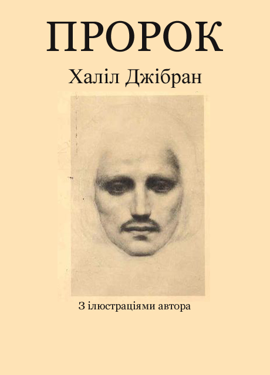
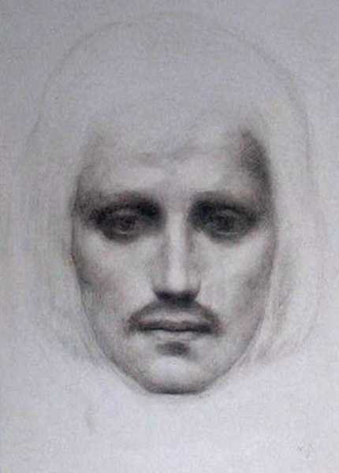
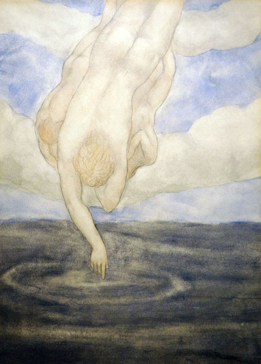
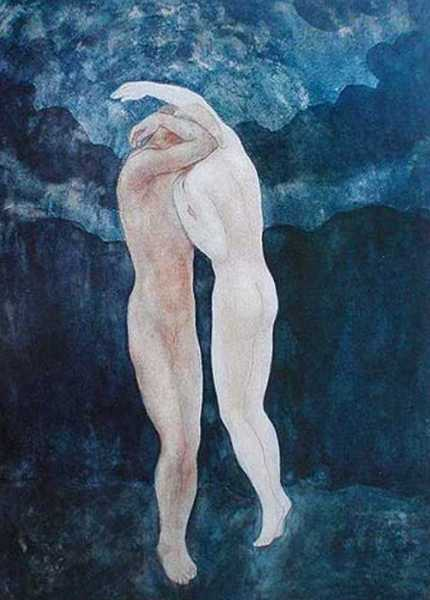
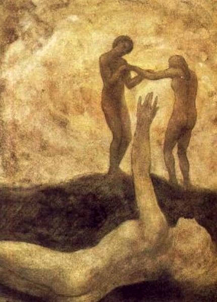
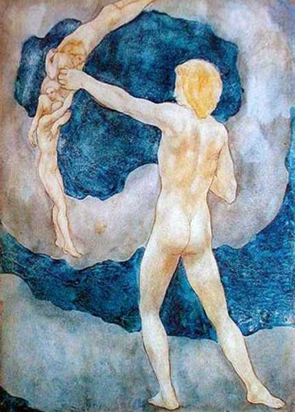
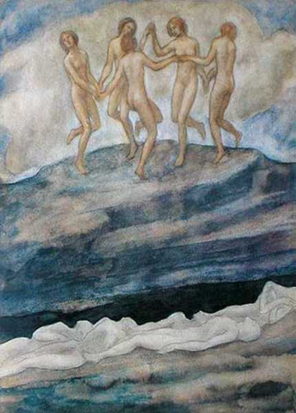
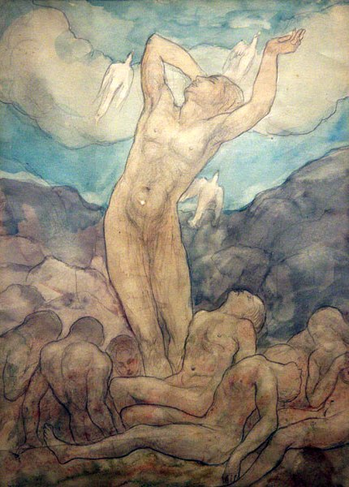
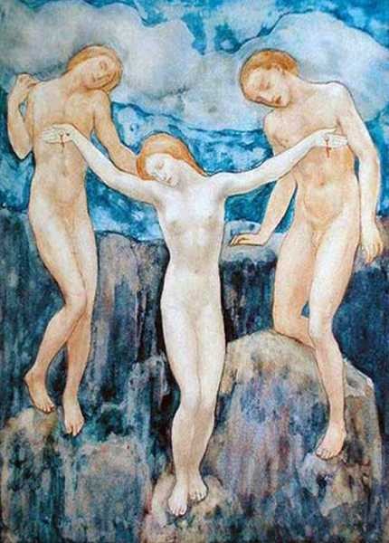
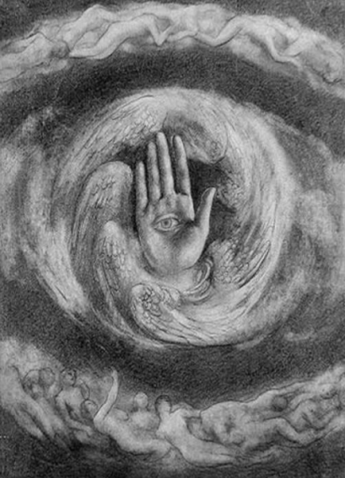

  

  

  

© Павло Насада, 1995, переклад українською мовою.

Перекладено за виданням: Kahlil Gibran. The Prophet. — William
Heinemann. 1983, London.

### Про автора  

Джібран, Халіл — американський поет і художник ліванського походження:
народився 1883 року в місті Бшеррі у Лівані; помер у квітні 1931 року
у Нью-Йорку. Найбільш відомий його твір «Пророк», який є серією з 28
поем у прозі. У цій книжці Джібран розмірковує над питаннями
загального гуманістичного характеру, над такими явищами, як
релігія, любов, добро і зло, задоволення і печаль. Текст наповнений
афоризмами і супроводжується графікою автора, яка за стилем нагадує
Блейка і Родена. Перша публікація книжки у 1923 році пройшла майже
непоміченою, але згодом її популярність стала нестримно зростати. До
середини 60-х років розійшлося більше двох мільйонів примірників
книжки.

Джібран народився у заможній і культурній родині, яка належала до секти
ліванських християн-маронітів. Ще хлопчиком він проявив значний талант
до літератури, образотворчого мистецтва та скульптури. Він навчався у
коледжі у Сірії і відвідував паризьку Ecole des Beaux Arts. Перш ніж
йому сповнилося 20 років, він уже прославився на всьому Близькому
Сході своїми п'єсами і поемами у прозі арабською мовою. Пізніше він
переїхав до Сполучених Штатів, де почав писати по-англійськи.

Серед інших його творів «Ісус, син людський» (1928), «Сад пророка»
(1933) та інші, опубліковані після смерті автора.

Джібран заповів усі прибутки від видання його творів рідному містові
Бшеррі, де міститься музей письменника і де щорічно відбуваються
святкування на його честь.

### Халіл Джібран

### ПРОРОК

  

  

#### Прихід Судна

Альмустафа, обраний серед людей, улюбленець багатьох, світанок власного
дня, дванадцять років очікував в місті Орфалез свого вітрильника, щоб
повернутись на острів дитинства.

У рік дванадцятий, в сьомий день місяця жнив він зійшов на пагорб за
мурами міста і кинув погляд свій на море: з туману виходило його
судно.

Широко відчинилась брама його серця, глибокий сум огорнув його і такі
думи пронизали серце:

— Як відійти мені у мирі і без жалю?

Ні, не покинути мені цього міста, зберігши дух невраженим.

Довгими були дні болю в стінах цього міста, безконечними ночі
самотності; а хто може без жалощів розпрощатися з болем і
самотністю?

Надто багато душі залишаю я на цих вулицях і надто багато дітей моїх
поривань бродять між цими пагорбами. Як покинути їх, як забути про
тягар і біль?

Нині не одяг старий скидаю я з плечей, але шкіру свою знімаю власними
руками.

Не думки залишаю позаду, але серце, впокорене голодом і спрагою.

Баритися, однак, не можна
більше.

Море, яке притягує до себе усе живе,
кличе і мене, я повинен піднятися на судно.

Бо залишитись наперекір швидкоплинним
годинам означатиме замерзнути, зледеніти, перетворитися на
камінь.

З радістю я б забрав із собою усе, що
тут навколо мене. Та чи можливо це? —

Язик і губи не линуть вслід за
голосом, хоча дають йому крила.

Він один піднімається до
ефіру.

Сам, залишаючи внизу гніздо,
здіймається в підсоння орел.

І ось біля підніжжя пагорба він знову
повертається обличчям до моря і бачить, як судно до гавані входить, а
під його вітрилами мореходи — діти рідного краю.

  

Душа його волає до них, і він
промовляє:

— Сини
моєї древньої матері, вершники прибою.

Як часто в мріях являлись ви мені під
вітрилами. А зараз ви приносите мені пробудження, і це найзаповітніша
моя мрія.

Відбути я готовий, і в своїх
пориваннях я разом з вітрилами ладен віддатися вітру.

А потім я стану між вами як рівний
між рівних.

А ти, безмежне море, спляча
мати,

Що мир і свободу даруєш ріці і
струмочку,

Вже недовго жебонітиме оцей
ручай,

І я прийду до тебе — бездонна
краплина у бездонний океан. —

Ідучи, ще здалеку побачив він чоловіків і жінок, які залишали свої поля
і виноградники, поспішаючи до міської брами.

І до нього долітали їхні голоси. Вони
вигукували його ім'я і передавали з поля на поля вість про те, що
прибуло судно.

  

Він запитав себе:

— Невже
день прощання стане днем великого збору?

Чи можна сказати, що сутінки стали
насправді світанком?

І що я зможу дати тому, хто плуг
залишив в борозді, чи хто відійшов від давильні, забувши про
виноград?

Чи стане моє серце деревом,
переобтяженим плодами, з якого всім їх даватиму?

Чи заб'ють бажання мої джерелом, щоб
наповнити їхні чаші?

Чи стану я лютнею під дотиком
Всемогутнього, чи флейтою, щоб подих Його оживить?

В мовчанні я жив і який скарб я
віднайшов у тиші, щоб достойно розділити між ними?

Якщо пора настала збирати врожай, то
в яку землю і в яку незапам'ятну пору кинув я сім'я?

Якщо справді час підняти вище
світильник, то не моє полум'я палатиме в ньому.

Порожнім і темним його
піднесу.

Наповнить олією його і вогонь піднесе
Охоронець ночі. —

  

Ці слова промовив він уголос. Та
багато невимовленого залишилося в його серці. Бо й сам він не в
силах висловити найпотаємніше.  

  

А коли увійшов він до міста, люд
тутешній вийшов йому назустріч і всі привітали його в один
голос.

Вийшли наперед старійшини і
сказали:

— Ще
не відходь від нас.

В сутінках сяяв ти для нас, а юність
твоя дарувала нам сни і мрії.

Не чужинець ти серед нас, не гість —
наш улюблений син.

Не примушуй страждати наші очі від
голоду за твоїм обличчям.

Промовляли до нього жерці і
жриці:

— Нехай
хвилі морські не розлучать нас зараз, нехай роки, проведені серед нас,
не поспішають стати пам'яттю.

Ти душу нам дав, а тінь твоя падала
світлом на наші обличчя.

Як ми любили тебе. Та безсловесною
була наша любов, невидимими запонами прихована.

Тепер же волає вона до тебе, ось вона
перед тобою.

Так завжди було і бачимо зараз, що не
знає любов своїх власних глибин аж до часу розлуки.

  

Інші теж підійшли і оточили його. Та
він не став відповідати їм. Він голову схилив, і ті, що стояли
найближче, бачили, як сльози покотилися йому на груди.

І всі люди разом з ним подалися на
просторий майдан перед святинею міста.

  

Жінка по імені Альмітра вийшла до них
із святилища. Вона була віщунка.

Він глянув на неї з ніжністю і
теплотою, бо саме вона знайшла його колись і повірила в нього чи
не з першого ж дня.

Вона привітала його, сказавши:

— Божий
пророче, шукачу безконечного, довгим був твій шлях до цього
вітрильника.

Тепер він прибув і ти повинен
залишити нас.

Твердий ти у стремлінні до землі
твоєї пам'яті, до батьківщини твоїх бажань; тож не зупинить тебе
наша любов, не втримають наші турботи.

Та перш ніж покинути нас, ось ми
просимо тебе промовити до нас словами істини.

Ми передамо її нашим дітям, а вони —
дітям своїм, і вона не щезне.

В своїй самотності ти був свідком
наших днів. Чутливий ти прислухався до ридань і сміху, що лунали в
наших снах.

Отож пора показати нам нас самих,
розкажи нам про все, що було явлено тобі, про все, що існує на межі
народження і смерті.

  

Він відповідав:

— Люди Орфалезу, чи зможу сказати вам
щось таке, що б і зараз не хвилювало ваших душ?

  

  

#### Про Любов

Альмітра попрохала: «Скажи нам про Любов».

Він підвів очі і пильно глянув поверх голів. Майдан неначе завмер.
Громовим голосом він почав:

— Коли любов покличе вас, ступайте їй услід,

Хоча круті і важкі її шляхи.

Покоріться їй, коли розпростере крила свої над вами, хоча зранить вона
вас мечем, схованим у перах.

Вірте їй, коли промовлятиме вона до вас, хоча її голос розпорошить мрії
ваші так, як північні вітри спустошують ваші сади.

Бо хоч любов підносить вас на трон, та потім вона розіпне вас, дбаючи
про ваш ріст, вона обчикрижить ваші віти.

Навіть коли вона піднімається до крони і пестить обернене до сонця
найніжніше, тремке гілля, вона не забуде відвідати ваші корені,
міцно прив'язані до землі, і потрясе їх безжалісно.

В'яже вона вас докупи, мов снопи.

Вона вимолочує з вас зерно.

Вона відсіює з нього полову.

Вона перемелює вас на білісіньке борошно.

Вона місить вас на м'якесеньке тісто.

Відтак садить вас у священний вогонь, щоб священним хлібом подати на
трапезу богам.

  

Усе це любов чинить з вами, щоб ви пізнали таємницю свого серця і цим
знанням прилучилися до таїни життя.

Та коли ви, боязкі, шукатимете в
любові вмиротворення і насолоди, то краще прикрити наготу свою і
податися геть подалі від тортур.

Податися у мертвий світ і сміятися
беззвучно, і ридати без сліз.

Любов не дає нічого, крім себе самої,
і тільки в собі черпає сили. Любов нічим не володіє, і ніхто не має
влади над нею.

Для любові достатньо любові.

  

Коли ви закохані, не слід говорити:
«Бог у моєму серці». Праведні слова: «Я у Божім серці».

Не гадайте, що ви можете наказувати
любові,— вона сама вестиме вас, коли визнає вас достойними.

  

У любові немає іншого бажання, крім
бажання бути довершеною.

Та коли ви кохаєте і відчуваєте
потребу чогось зажадати, нехай оці будуть вашими єдиними
бажаннями:

Танути, мов сніг, текти ручаєм,
даруючи свої мелодії ночі.

Спізнати біль безмежної
ніжності.

Достойно нести рани власного пізнання
любові.

Добровільно і радісно проливати кров
свою.

Прокидатись на світанку з окриленим
серцем і бути вдячним за ще один день щастя.

Знаходити вмиротворення в опівнічну
годину і переповнюватися нестямним захватом.

З вдячністю повертатись додому
вечірньою порою.

І засинати з молитвою до коханої, з
похвальним гімном на устах.

  

  

#### Про Шлюб

І знову озвалася Альмітра: «Що повідаєш нам про Шлюб, учителю?»

І відповідав він так:

— Разом були ви народжені, разом вам залишатися назавжди. Авжеж, у
мовчазній пам'яті Бога ви теж спочиватимете вдвох.

Та нехай у вашій спільності залишаються прогалини.

І хай вітри піднебесся кружляють поміж вами.

Любіть один одного, та нехай не стане путами для вас кохання. Краще
нехай розіллється воно неспокійним морем між берегами ваших душ.

Наповнюйте чаші один одного, але не пригублюйте тільки з однієї.
Діліться хлібом вашим, та не відламуйте від однієї хлібини.

Співайте і танцюйте разом і звеселяйтеся, але нехай кожен з вас
залишається самотнім.

Бо ж, хоча й тремтять однією мелодією, але натягнуті окремо на лютні
струни.

  

Віддавайте один одному свої серця, але не на зберігання,

Бо тільки саме життя обіймає в собі ваші серця.

Стійте разом, а все ж не надто близько:

Адже колони в храмі теж стоять порізно,

І дуб з кипарисом не можуть рости у тіні один одного. —

  

  

#### Про Дітей

Аж ось жінка з дитям біля груді сказала: «Розповіси нам про Дітей».

Він відповідав так:

— Діти ваші зовсім не ваші.

Вони — сини і доньки самодостатнього життя. Від вас вони народжуються,
та не через вас.

І хоча вони з вами, належать діти не вам.

  

Ви можете віддати їм свою любов, але не свої думки, бо у них є власні.

Ви даєте притулок їхнім тілам і ніколи душам,

Бо притулок їхніх душ — майбутнє. Не
відвідати вам його навіть у снах.  

Ви можете і намагайтесь бути схожими на них, та утримуйтеся від спроби
повторити в них себе.

Бо життя ніколи не оглядається назад, не бариться в учорашньому дні.

Ви — луки, з яких діти рвуться вперед, наче стріли.

Найвищий Стрілець бачить ціль на стежі у безконечність, і Він згинає
тебе Своєю силою, щоб стріли Його летіли швидко і далеко.

Щоб зазнати радості, піддавайся Стрільцеві, як лук, бо коли Його серцю
мила стріла, що летить, то любить Він і лук, який залишається в руках.
—

  

  

#### Про те, як Давати

Відтак озвався багач: «Розкажи нам про те, як Давати».

І він відповів;

— Мало ви даєте, коли вділяєте від вашого добра.

Коли ж віддаєте самих себе, то справді ви щедрі.

Бо що ваше добро, як не речі, які ви бережете і накопичуєте зі страху,
що завтра вони можуть знадобитись?

А завтра, що принесе з собою завтра для ощадливого собаки, що закопує
кістки в текучих пісках, плентаючись за прочанами до святого міста?

А страх перед майбутніми потребами хіба не є потребою?

А якщо ви жахаєтесь спраги, коли колодязь ваш повний, то хіба це не є
невтолимою спрагою?

Є такі, що дають дуже мало з того, чим володіють,— і дають лише для
самоствердження, і потаємні бажання роблять дари їхні огидними.

А є такі, що мають мало, але віддають усе.

Вони істинно вірять в життя і його щедроти, скрині їхні ніколи не
бувають порожніми.

Декотрі дають з радістю, і радість — їхня нагорода.

Інші дають з болем, і цей біль — їхній хрест.

А є й такі, що дають і не зазнають болю і не шукають радості, не думають
про відплату за доброчинність:

Вони щедрі, як оте миртове дерево в долині, що ділиться своїми пахощами
з небом.

Руками таких, як оці, промовляє сам Бог, їхніми очима Він усміхається
до нас.

  

Добре давати, коли тебе попрохають, а ще краще — без прохання, від
самого розуміння речей.

Для людини з щедрою рукою більше важить найти того, кому потрібна
допомога, ніж радість самовіддачі.

Чи існує щось таке, що б ви хотіли втримати у себе?

Прийде день, коли доведеться віддати усе, чим володієте.

Тому нехай пора віддавати настане ще для вас, а не прийде неждано для
ваших спадкоємців.

  

Часто кажете ви: «Даватиму тим, хто заслуговує».

Ніколи не почуєте ви такого від дерев у вашому саду, від череди на
вашому пасовиську.

А вони дають, щоб жити, бо згинуть інакше.

Справді, ті, хто вартий отримати свої дні і ночі від Провидіння,
достойні одержати усе інше від вас.

Тому, хто заслуговує пити з океану життя, нехай дозволено буде наповнити
чашу з твого джерельця.

І чи може бути більша заслуга, ніж та, що полягає в мужності і
виваженості, більше того, любові, з якими ви віддаєте.

Хто ви такі, щоб люди роздирали одяг, оголювали свою гордість для того
тільки, щоб ви могли побачити їхню вартість і непохитну гордість?

Погляньте спочатку, чи ви варті давати і бути знаряддям помочі.

Бо насправді тільки життя дає для життя, в той час як ви, коли вважаєте
себе щедрими, насправді — лише свідки.

А ви, які приймаєте дари,— а ви всі такі — не надавайте надмірної
ваги вдячності, якщо не хочете
накласти ярма ні на себе, ні на вашого благодійника.

Краще зіпріться разом з ним на його
дари, як на крила;

Бо, перебільшуючи значення його
дарів, ви тим самим сумніватиметесь в його щедрості. Матір'ю йому
доброзичлива земля, а батьком — сам Бог. —

#### Про Їжу і Пиття

Тут чоловік похилого віку, власник заїжджого двору, запитав: «Чи можеш
розповісти нам про Їжу і Пиття?»

Він почав так:

— Якби ви могли жити пахощами землі і як рослини живитися сонцем\!

Та вже коли ви мусите вбивати, щоб жити, і обкрадати новонароджених від
материнського молока, щоб вгамовувати спрагу, нехай це буде актом
милосердя.

Нехай мужі ваші поставлять алтар, на якому усе чисте і невинне з лісів і
рівнин приноситиметься в жертву тому, що є найчистішого і найневиннішого
в людині.

  

Коли ви вбиваєте тварину, промовляйте до неї щиро:

«Та ж сила, що умерщвляє тебе, погубить колись і мене, я також буду
спожитий.

Бо закон, який дав мені тебе до рук, мене передасть колись у руки
набагато могутніші.

І твоя кров і моя — не що інше, як живиця, що годує дерево небес».

Коли ти вгризаєшся зубами в яблуко, промов до нього нечутно:

«Твоє насіння житиме в моєму тілі,

Зав'язь твого завтрашнього дня цвістиме в моєму серці.

Твої пахощі стануть моїм подихом,

І разом нам радіти через усі пори року».

  

А восени, коли ти збираєш грона на своєму винограднику, щоб піддати їх
тиску в давильні, промов щиросердно:

«Я теж виноградник, і мої плоди будуть зібрані на трунок,

І, немов молоде вино, я буду у вічних міхах зберігатись».

  

А взимку, як куштуватимеш п'янку вологу, нехай у твоєму серці знайдеться
пісня для кожної чаші;

І нехай у цій пісні буде згадка про осінь, про виноградник і про
давильню. —

#### Про Працю

Попрохав плугатар: «Хочемо почути про Працю».

Його слова були такі:

— Ви працюєте, щоб не тікала вам з-під ніг земля, щоб ближчою вам була
її душа.

Було бути бездіяльним — означає стати чужинцем під сонцем, відстати від
процесії життя, яке велично прямує у гордій покорі до вічності.

  

Коли ви трудитеся, ви стаєте музичним інструментом, з якого беззвучні
години добувають музику.

Хто з вас хоче стати тростиною, глухою і мовчазною, коли все інше співає
в єдиній гармонії?

  

Вам завжди твердили, що праця — то нещастя і прокляття.

Та кажу вам я: коли ви трудитесь, ви виконуєте частину далекоглядної
мрії землі, переданої вам від народження.

Не покладаючи рук, ви живете праведним життям.

А любити життя через працю — означає бути наближеним до найглибшої
таємниці життя.

  

Але якщо ви, жахаючись болю, називаєте своє народження недугом, а
живлення плоті — прокляттям, витаврованим на чолі, то відповідаю
вам, що тільки в поті чола позбудетеся таких думок.

Говорили вам також, що життя — це
темрява, і втомлені, ви підхоплювали те, що нашіптувала
втома.

Знайте ж, що воно — справді темрява,
якщо в ньому брак поривань.

Усі поривання сліпі, якщо бракує
знання.

Усі знання даремні, коли немає
праці.

Усілякий труд пустопорожній, якщо в
нього не закладена любов.

Коли ви трудитеся з любов'ю, ви
знаходите примирення самі з собою, один з одним і з Богом.

Що ж означає працювати з
любов'ю?

Щоб виткати полотно, тягніть нитки з
самого серця, так, немов ваша кохана носитиме одяг з цього
полотна.

Зводячи будинок, вкладайте в
підмурівок свої почуття, так, немов у цьому домі мешкатиме ваше
кохання.

Кладіть сім'я у землю з ніжністю,
збирайте врожай з радістю, так, наче плоди ці для коханого.

Вкладайте у речі самого себе,
вдихайте у них свою душу.

Знайте, що ваші благословенні предки
поруч з вами і спостерігають.

  

Часто я чув, як промовляли, наче зі
сну, таке: «Той, хто ріже мармур, надаючи йому форми власної душі,
робить почеснішу справу, ніж той, хто плугом ріже ріллю.

І той, хто переносить багатство
веселки на полотно, творячи подобизну людини, значить більше того,
що для наших ніг майструє взуття».

Слухайте ж мене, говорю вам з
розплющеними очима тут, у передвечірній час, що вітри
промовляють до велетенських дубів не солодше, ніж до
наймізернішої з бадилинок;

Того назову справді великим, хто
обертає голос вітрів на солодкозвучну пісню силою своєї
любові.

  

Праця — це любов, яку сприймаємо
зором.

Коли ви не можете працювати з
любов'ю, а тільки з відразою, краще облиште ваше заняття, знайдіть
собі місце біля брами храму і приймайте милостиню від тих, хто трудиться
з любов'ю.

Бо, коли випікаєте хліб з байдужістю,
з печі дістанете гіркі хлібини, які не наситять голодних.

Коли зі злим серцем давитимете
винограда, ваша злоба отрутою просльозиться у вино.

І співайте ви хоч ангельським
голосом: коли спів вам не до душі, люди оглухнуть і не
розрізнятимуть більше звуків дня і звуків ночі. —

#### Про Радість і Журбу

Якась жінка попрохала: «Оповіси нам про Радість і Журбу».

Він відповідав так:

— Ваша радість — це та ж сама журба без маски.

Той самий колодязь, з якого ви черпаєте сміх, часто наповнюється
сльозами.

Та й чи може бути інакше?

Чим глибше вкарбовується журба у ваше єство, тим більшої радості ви
можете досягти згодом.

Ваша чаша, повна вина, хіба не та сама чаша, яка пройшла випробування
вогнем у печі гончара?

А лютня, що насолоджує ваш слух, не те саме дерево, в яке врізався ніж
ремісника?

Коли вас переповнює радість, загляньте глибше у своє серце, і ви
переконаєтеся: те, що наповнювало вас журбою, зараз приносить
вам радість.

Коли журитесь, ще раз загляньте у власне серце і ви побачите: ви справді
ридаєте від того, що було для вас насолодою.

  

Дехто з вас каже: «Радість сильніша, ніж журба», а інші навпаки: «Ні,
журба».

Я ж кажу вам: вони
нероздільні.

Разом ходять вони, і коли одне з них
сидить за твоїм столом, то пам'ятай, що друге тим часом спочиває на
твоєму ложі.

  

Воістину, ви, наче терези, ніколи не
приходите в рівновагу між журбою і радістю.

І лише коли ви спустошені, приходить
вмиротворення і рівновага.

І коли врешті Скарбник візьме твою
душу, щоб зважити золото і срібло, то аж тоді переважать радість або
журба. —

  

  

#### Про Житло

Крок уперед ступив каменяр і сказав: «Розкажи нам про Житло».

Така була відповідь:

— Перед тим як зводити кам'яницю у мурах міста, силою уяви збудуй оселю
в пущі.

Бо коли в надвечір'ї ви шукаєте домашнього затишку, те ж саме відчуває
ваша мандрівна душа, завжди віддалена і самотня.

Помешкання — ваше велике тіло.

Воно виростає на сонці і спочиває в тиші ночі, в ньому блукають сни. Чи
не так?Забуваючись у дрімоті, воно залишає місто і гуляє в гаях і на
пагорбах.

  

Якби я міг зібрати всі ваші будинки в жменю і розсіяти їх в лісах і
лугах\!

Якби долини стали вашими вулицями, а зелені стежини — алеями, щоб ви
знаходили один одного, минаючи виноградники, і приходили із пахощами
землі у складках свого одягу.

Та цьому ще не судилось
звершитись.

Ваші предки, переслідувані страхом,
зібрали вас надто близько докупи. І страхи ці ще триватимуть якийсь
час. Ще якийсь час міські стіни відділятимуть ваші серця від
полів.

  

Скажи мені, народе Орфалезу, чому ви
тримаєтеся своїх осель?

Що стережете ви за замкненими
дверима?

Чи панує там мир — тихий володар,
котрий наділяє вас силою?

Чи зберігаються спогади — яскраві
веселки над вершинами вашого духу? Чи живе там краса, яка веде ваше
серце від захоплення дріб'язком, змайстрованим з дерева та каменю, до
святих вершин?

Скажіть мені, чи є це у вас в
помешканнях?

Чи тільки зручності і вигоди та
пошуки за ними, що прослизають у дім зрадливими гостями, стають
господарями, а згодом і повелителями?

  

І горе вам, прибирають вас до рук,
бичем і палицею перетворюють в покірних маріонеток ваші наймиліші
мрії.

Хоча шовкові їхні обійми — із заліза
їхні серця.

Вони заколисують у сон, щоб стояти
біля ложа і кпити з гідності вашої плоті.

Вони насміхаються з вашого здорового
глузду, розбивають його, наче крихкий посуд, розвіюють його по
вітру.

Воістину, бажання зручностей вбиває
пристрасті душі і з кпинами, криво посміхаючись, іде за гробом.

  

Та ви, діти просторів, непогамовні в спокою, вас не впіймати і не
приборкати.

Не якорем, але мачтою стане для вас
дім.

То не буде тьмяна плівка згуслої
крові на рані, але повіки, що
бережуть очі.

Ви ані складатимете крила, щоб пройти
у двері, ні схилятимете голови, щоб не зачепити стелю, ні боятиметеся
дихати на повні груди в страху, що не витримають і падуть
стіни.

І не шукати вам притулку у склепах,
збудованих мертвими для живих.

Незалежно від пишноти і блиску, дім
ваш ні приховуватиме таємниць, ні ховатиме ваших сподівань.

Бо те, що безконечне у вашому єстві,
перебуває в небесному домі, де дверима слугує ранковий серпанок, а
вікнами — пісні і тиша ночі. —

#### Про Одяг

Обізвався ткач: «Хочемо почути слово про Одяг».

Він промовив так:

— Багато з вашої краси приховує одяг, однак не може сховати потворного.

Хоча під вашим одягом ви шукаєте свободи тілесної, він може стати для
вас путами і тягарем.

Чи не краще виставляти назустріч сонцю ваше оголене тіло, ніж ваші шати.

Бо у сонячному світлі дихає життя, а рука його — вітер.

Дехто з вас скаже: «Це вітер півночі примусив нас виготовити одяг».

Кажу вам: нехай це був вітер півночі.

Але справжній ткацький верстат — це сором, а волокном стали ослаблені
м'язи.

І коли робота була завершена, він заходився сміхом у лісових нетрях.

Не забувайте, що сором'язливість — ваш щит від очей нечисті.

А коли її не стане, чим буде сором'язливість як не оковами і наругою над
душею?

І ще не забувайте, що земля насолоджується дотиком ваших босих ніг, а
вітри пориваються бавитися вашими косами. —

#### Про те, як Купувати і продавати

Черга запитувати прийшла до купця: «Розкажи нам про те, як Купувати і
продавати».

Він відповідав:

— Для вас земля вирощує свої плоди, і ви не будете голодні, якщо
знатимете, як наповнити свої руки.

Обмінюючись дарами землі, ви знайдете достаток і вдоволення.

Коли ж віддаєте один одному без любові, без чуйної справедливості, то це
неминуче приведе одних до захланності, інших — до голоду.

  

Коли на торговому майдані зійдуться трударі моря, полів і виноградників
з ткачами, гончарами, збирачами прянощів,—

Нехай прикличуть вони духа землі зійти серед них і освятити терези,
допомогти виважувати вартість супроти вартості.

Не вважайте за лихо, коли для обміну до вас приходитимуть люди з
порожніми руками, намагаючись продати свої слова за вашу працю.

Таким скажіть:

«Ходімо з нами в поле або з нашими братами до моря закинути невід;

Бо щедроти морей і тверді однакові для нас, як і для вас».

  

А коли з'являться співаки і танцюристи з флейтистами,— візьміть і від
їхніх дарів.

Бо вони також збирачі плодів і пахощів, а те, що вони приносять, хоча й
зіткано з мрій, є одягом та їжею для ваших душ.

  

І перед тим як покинути торговище, погляньте уважно, чи ніхто не іде
звідти з порожніми руками.

Бо душа землі не заспокоюється, доки
потреби найостаннішого з вас не будуть задоволені. —

#### Про Злочин і Кару

Тоді один із суддів міста виступив наперед і сказав: «Розкажи нам про
Злочин і Кару».

Він відповідав:

— Коли ваша душа безпечно гуляє з вітрами,

Саме тоді, залишені наодинці без догляду, ви чините шкоду іншим, а через
це і самим собі.

І в покарання за заподіяне зло залишитеся непоміченими і непочутими,
коли стукатимете до брами вічності.

  

Немов океан, ваша божественна суть.

Вона завжди залишається цнотливою,

І в піднебесся підносить тільки окрилених.

Ваша богоподібна сутність рівна сонцю,

Вона не знає кротячих нір, їй чужі підземелля змій.

Та божественна суть не сама мешкає у вашому існуванні.

Багато в чім ви все ще люди, в дечому вам ще далеко до людини;

Потворними карликами блукаєте із заплющеними очима в мороці, чекаючи
пробудження.

І настав час сказати про людяне у вас.

Бо людяність, а не ваше божественне начало і не карлик у мороці знає, що
таке злочин і кара.

  

Часто я чув, як ви говорили про того, хто скоював переступ, буцімто він
не один з вас, а чужий вам, незваний гість у вашому світі.

Я ж твердитиму, що так само як святість і правота не зможуть піднестися
вище правди, яку ви носите в собі,

Так і озлоблення і ницість не можуть упасти нижче, ніж є вони у вас.

І так само як поодинокий листок не зжовкне без мовчазної згоди цілого
дерева,

Так і злочинець не може вчинити зла без прихованої волі вас усіх.

Це як процесія, коли ви прямуєте до своєї божественної суті.

Ви одночасно і шлях і мандрівники.

І коли один з вас не втримується на ногах, він падає для тих, хто позаду
нього, наче попередження про небезпечну перепону.

Він падає також і для тих, хто далеко попереду. Вони ідуть швидше, у них
міцніші ноги, та все ж вони не прибрали з дороги небезпечну каменюку.

  

Вислухайте і таке, хоча слова мої ляжуть тягарем на ваші серця:

Замордований не може бути невідповідальним за свою смерть.

Обкрадений не є безвинний у тому, що його ограбували.

Справедливі також несуть на собі провину за вчинки підступних.

І незаплямованих чорнить чуже злодійство.

Справді, провина часто є жертвою зневажених.

Але набагато частіше приречений несе на собі тягар замість безвинних і
оправданих.

Не можна відділяти справедливість від несправедливості і добро від зла;

Перед обличчям сонця стоять вони поруч, так само як у полотні
переплітаються чорні і білі нитки.

І, коли вривається чорна, ткач уважно приглядається до усього сувою
полотна і перевіряє ткацький верстат.

  

Якщо хтось із вас приведе на суд невірну дружину,

То зважте на терезах і серце чоловіка, вивчіть і його душу.

Той, хто бичуватиме переступника, нехай випробує і душу жертви.

Той з вас, хто каратиме в ім'я справедливості, заносячи лезо над хворим
гіллям, нехай кине погляд і на коріння;

Неминуче знайде він там коріння добра
і коріння зла, життєдайне разом з безплідним, які міцно сплетені
проростають в мовчазну душу землі.

А ви, судді, що вважаєтесь
справедливими,

Який присуд ви проголошуєте над тими,
які незаплямовані діями, а все ж злочинці в душі?

Яку покуту накладаєте ви на тих, хто
вбиває, а насправді і сам тяжко вражений у душі?

Як переслідуєте ви тих, хто діями
своїми зрадник чи гнобитель,

А в той же час ображений і
переповнений гнівом?

  

Як каратимете тих, чиє розкаяння уже перевищує скоєні лиходійства?

Хіба спокута не є тим правосуддям,
яке ви повинні вершити, чиїм законам ви повинні з радістю
слугувати?

Проте ви не можете накласти спокуту
на безвинного, ні викликати її в серці винуватого.

Непрошеним волатиме воно серед ночі,
щоб люди прокинулися і поглянули на себе.

А ви, кому відома справедливість, як
ви можете бути певні в ній, коли не розглянете усі вчинки в ясному
сонячному світлі?

Тільки тоді ви достоту переконаєтеся,
що і той, хто міцно стоїть на ногах, і той, хто вже впав подоланий,— це
одна й та ж сама людина, вона зупинилася в сутінках на межі між ніччю
своєї мізерності і днем богоподібної сутності; і що підвалина храму
теж не лежить вище найнижчого каменя в його мурах. —

#### Про Закони

Тут запитав знавець законів: «Скажи нам про наші Закони, учителю».

Він відповідав так:

— Ви знаходите вдоволення в укладанні законів.

Порушувати їх — ще більша вам утіха.

Так само діти бавляться на березі океану і наполегливо вибудовують башти
і стіни з піску, а потім руйнують їх сміючись.

А поки ви зводите свої нетривкі споруди, океан виносить на берег усе
більше піску, і коли руйнуєте їх ви, сміється океан.

Безперечно, океан сміється разом із праведними.

  

Та що сказати про тих, для кого життя не океан, а людьми встановлені
закони — не вежі з піску,

Для кого життя скеля, а закон — різець, яким вони писатимуть на камені
по своєму вподобанню?

Що сказати про немічного каліку, який ненавидить танці?

Що сказати про підневільного вола, якому до вподоби його ярмо, який
вважає лося і оленя безпритульними волоцюгами?

Чи про стару змію, яка не може скинути свою ветху шкіру і називає усіх
інших голими і безсоромними?

Чи про того, хто перший приходить до весільного столу, а, переївшись і
втомившись, іде собі геть, примовляючи, що всі свята — зневажання
законів, а святкуючі — порушники цих законів?

  

Що про них сказати, як не те, що вони стоять у сонячному світлі, але
обернені до сонця спиною?

Вони бачать тільки свої тіні, і ті є їхніми законами.

І сонце для них не більше, ніж щось, що породжує тіні.

Отже, щоб прийняти закони, слід тільки нахилятися і вивчати їхні тіні на
землі.

А ви, що прямуєте, не відводячи обличчя від сонця, які примари на
поверхні землі можуть утримати вас?

Ви, що мандруєте разом з вітрами, який флюгер може вказати вам шлях?

Який людський закон зв'яже вас, якщо ви рвете не людиною накладені на
вас пута Яких законів боятиметесь ви, якщо ви танцюєте і вам не
заважають ніякі залізні пута? 

І чи знайдеться такий, щоб осуджував вас, коли ви зриваєте з себе одяг,
не перешкоджаючи нікому?

Люди Орфалезу, ви можете приглушити грім литавр, попустити струни на
лірах, та хто з вас зможе примусить замовкнути жайворонка? —

#### Про Свободу

Оратор сказав: «Навчи нас, що таке Свобода».

Він відповідав:

— Чи біля міської брами, чи біля родинного вогнища я бачив, як ви
падаєте ниць, поклоняючись власній свободі,

Так само як раби принижуються перед тираном, хоча він знищує їх.

  

Справді, у священному гаю і в затінку фортечних стін бачив я, як
найвільніші серед вас носять свою свободу, наче ярмо чи кайдани.

І серце моє спливало кров'ю; вільними ви станете лише тоді, коли навіть
бажання шукати свободи стане для вас тягарем, коли перестанете говорити
про свободу як про кінцеву мету.

По-справжньому ви будете вільними, коли вашим дням не бракуватиме
турбот, а ночам — бажань і печалі.

Чим більше їх буде у вашому житті, тим швидше ви піднесетеся над ними,
звільнені від усього, нічим не зв'язані.

  

Але як вам піднятися над вашими днями і ночами, якщо ви не розіб'єте
ланцюгів, якими на світанку прозріння ви полонили свій полудень?

По правді кажучи, те, що ви називаєте свободою, є найміцнішим з цих
ланцюгів, хоча кільця його виблискують на сонці і засліплюють вам
очі.

  

Що це таке, як не частки вашого «я», якими вам доведеться пожертвувати,
щоб справді стати вільними?

Якщо доведеться скасувати несправедливий закон, то пам'ятайте, що закон
цей був написаний вами і визрів він у ваших головах.

Ви не можете просто знищити його, спаливши книги законів, ні вимити його
з голів ваших суддей, навіть проливши на них море води.

І якщо ви скидаєте з трону тиранів, пам'ятайте, що найперше повинен бути
знищений їхній трон, зведений у вашому серці.

Бо хіба може тиран правити вільними і гордими, як не з допомогою тиранії
їхньої свободи і сорому від їхньої гордині?

І якщо ви хочете позбутися страху, то вмістилище цього страху у вашій
душі, а не в тому, чого ви боїтеся.

Дійсно, усе, що існує у вашому бутті, тісно переплетене між собою, те,
чого ви прагнете, разом з тим, чого жахаєтеся, разом співіснує
мерзотне й найлюбіше, те, до чого ви намагаєтеся наблизитись, і
те, від чого тікаєте. —

  

#### Про Розум і Пристрасть

І знову промовила Альмітра: «Скажи нам про Розум і Пристрасть».

Він відповідав так:

— Полем битв часто стає ваша душа. Там ваш розум і судження ведуть війну
з вашими пристрастями і бажаннями.

Коли б я міг стати миротворцем у ваших душах, щоб перетворити безлад і
ворожнечу у вашому єстві у єдність і гармонію.

Та хіба це під силу мені, коли ви самі також не станете миротворцями,
більше того, коли ви не любитимете однаково усі прояви своєї душі?

  

Ваш розум і ваші пристрасті — це стерно і вітрила ваших мандрівних душ.

Чи вітрила, чи стерно вийдуть з ладу — вам або доведеться пливти по воді
хвиль, або серед повного штилю завмерти посеред моря.

Бо розум, облишений сам на себе,— це тільки сила, яка сковує вас; а
пристрасть — це вогнище, яке палає невгасимо аж до самознищення.

Отож нехай ваша душа піднесе розум до висот пристрасті, щоб він пролунав
піснею;

Нехай вона спрямовує ваші пристрасті з допомогою розуму, щоб жага могла
відроджуватися щодня і, як Фенікс, здіймалася над своїм попелом.

  

Я б хотів, щоб ви сприймали свої судження і прагнення так, як приймаєте
бажаних гостей у своєму домі.

Ви ж звичайно не станете вшановувати одного з них більше; бо той, хто
усі помисли віддає комусь одному, втрачає любов і довіру обох.

Коли ви спочиваєте серед пагорбів у затінку білих тополь, вдихаючи мир і
чистоту віддалених полів і лугів,— нехай ваше серце вимовить мовчки: «На
розум опирається Бог».

А коли налітає буря і потужні вітри колишуть лісами, грім і блискавки
проголошують велич неба,— побожний страх огорне ваше серце і воно
прошепоче: «Через пристрасть являється нам Бог».

Ви самі, які лише легкий подих у Божих сферах, лише листочки у Божому
лісі, теж повинні спиратись на розум, проявляти своє єство у
пристрасті. —

#### Про Біль

Жінка з натовпу попрохала: «Скажи нам про Біль».

Він промовив:

— Ваш біль — це руйнування мушлі, в якій заховане пізнання.

Так само як плодова кісточка повинна тріснути, щоб проросла насінина, ви
повинні спізнати біль.

Якби ваше серце постійно перебувало в пошуках і очікуванні чудесних
проявів буденного життя, ваш біль здавався б вам не менш загадковим
і таємничим, ніж радість;

Ви б сприйняли весну і осінь вашого серця так само, як звикли приймати
зміни пір року на ваших полях.

Ваш незатуманений погляд з легкістю прозиратиме у суворі зими горя.

Ваш біль — здебільшого вибраний вами самими.

Він — гірке зілля, яким ви, самі собі лікарі, виходжуєте хворі душі.

Довіртесь лікареві, мовчки і спокійно приймайте його ліки;

Бо його рука, така важка і жорстока, спрямовується чулою рукою
Невидимого;

А чаша, яку він вам підносить, хоча обпалює вам губи, була виліплена з
глини, яку Гончар змочив власними священними сльозами. —

  

#### Про Самопізнання

Якийсь чоловік попрохав: «Розкажи про Самопізнання».

Він сказав:

— Ваші мовчазні серця відають таємниці днів і ночей.

А вуха ваші прагнуть почути дещицю цього знання.

Ви хочете почути слова, які завжди існували невимовленими у ваших
думках.

Ви хочете своїми перстами торкнутися оголеної суті своїх мрій.

  

Так воно і повинно бути.

Глибоко заховані джерела ваших душ повинні пробитися назовні і побігти з
веселим плюскотом до моря;

Скарби нескінченних глибин повинні явитись вашим очам.

Проте не існує таких терезів, щоб зважити на них ці невідомі цінності.

Не міряйте глибини самопізнання звичними мірками.

Бо кожен з вас, наче море, безмежний і бездонний.

Не кажіть: «Я знайшов стежину душі». Краще говоріть: «Я зустрів душу, що
мандрувала по моїй стежині». Бо душа ходить усіма шляхами і ніколи
насправді не проростає стрункою очеретиною. Душа, наче квітка
лотосу, розкривається незліченними пелюстками. —

#### Про Навчання

Тоді озвався учитель: «Скажи нам про Навчання».

Він відповів так:

— Жодна людина не може передати вам нічого, окрім того, що вже
прокидається зі сну у світанку ваших знань.

Учитель, що проходжується у затінку храму в оточенні своїх учнів, не дає
нічого зі своєї мудрості. Він ділиться своєю вірою і любов'ю.

Коли він справді мудрий, він ніколи не проситиме вас увійти в дім своєї
мудрості, він проведе вас до порогу вашого власного розуму.

Астроном може розказати вам про своє розуміння простору, але самого
розуміння він вам не передасть.

Музикант може відтворити музику і ритм, якими повниться космос, але не
передасть свій тонкий слух, що вловлює цей ритм, ані голос, що
відтворює мелодію.

Той, хто обізнаний з наукою чисел, може розповісти вам про країну
вимірів та обчислень, та він не запровадить вас туди.

Бо світобачення однієї людини не може поділитися своїми крилами з
іншими.

І так само, як кожен з вас відомий Богові як неповторна істота, кожен з
вас повинен самотужки пізнати Бога, самостійно дійти до розуміння
життя. —

#### Про Дружбу

Юнак попрохав: «Розкажи нам про Дружбу».

Він почав так:

— Ваші друзі — це відповідь на ваші потреби.

Друг — це поле, яке ви засіваєте любов'ю і доглядаєте вдячністю.

Він — ваш щоденний стіл, ваше вогнище.

Бо ви приходите до нього в голоді і спразі, ви шукаєте у нього
вмиротворення.

  

Коли друг ділиться з вами потаємними думками, ви не боїтеся вимовити
своє «ні», не втримуєте в собі «так».

А коли він мовчазний, ваша душа безнастанно прислухається до його серця;

Бо у дружбі всі думки, усі прагнення і сподівання народжуються і
переходять від одного до другого без слів, без надмірних проявів
радості.

Коли ви прощаєтеся з другом, ви не сумуєте;

Адже те, що вам найдорожче у ньому, може ще ясніше виявитися у час його
відсутності. Той, хто збирається підкорити вершину, найкраще бачить її
з рівнини.

Нехай у дружби не буде ніякої мети, крім збагачення духу.

Бо любов, що перебуває у пошуках будь-чого, крім пізнання власної
таємниці,— це не любов, а закинутий у води життя невід: тільки
недосконале попадається в нього.

  

І нехай усе найкраще, що маєте, буде для вашого друга.

Коли йому відома найнижча межа вашого припливу, нехай він побачить і
його повноводдя.

Хіба для того ви прагнете товариства свого друга, щоб убити свій час?

Спілкуйтеся з ним, щоб прожити свій час.

Друг рятує вас у потребі, а не наповнює вашу пустоту.

Нехай вашу ніжну дружбу супроводжує радісний сміх і спільна втіха.

Бо в дрібних крапельках роси душа знаходить свій ранок, своє
пробудження. —

#### Про науку Розмовляти

Тоді вчений муж сказав: «Розкажи нам про науку Розмовляти».

Він відповідав так:

— Ви розмовляєте тоді, коли перестаєте бути в мирі з вашими думками.

Коли ви більше не можете ховатися в самотності своєї душі,
ви продовжуєте жити власними
губами, а звуки мови — лише попутня розвага.

В більшості з ваших розмов ви наполовину вбиваєте думку.

Бо думка — це птах просторів. У клітці слів вона може розправити крила,
та ніколи їй не злетіти.

  

Серед вас є такі, що шукають розмов від остраху залишитися на самоті.

Мовчазна самотність відкриває їхнім очам власну порожнечу, і тому вони
намагаються втекти.

А є такі, хто, розмовляючи, самі не знають і не передбачають, що їхніми
устами глаголить істина. Хоча самі вони про це не здогадуються.

Є ж серед вас і ті, що носять у собі істину, та ніколи не передають її
словами.

В грудях таких, як вони, душа перебуває у мовчазній злагоді.

  

Коли ви зустрічаєте друга на уздоріжжі чи на торговищі, нехай душа ваша
рухає губами і водить язиком.

Нехай голос вашого голосу звучить для найтоншого слуху його вух;

І його душа збереже істину твого серця так само, як ми пам'ятаємо смак
вина, коли колір уже забутий і поряд немає чаші. —

#### Про Час

Запитав астроном: «Що ми знаємо про Час?»

І він відповів так:

— Ви звикли вимірювати час, хоча він безмежний і вимірам не підвладний.

— Ви звикли пристосовувати свою поведінку і спрямовувати поривання своєї
душі згідно з перебігом годин і пір року.

Ви уявляєте час, як струмок, на березі якого можна спочивати і
спостерігати за тим, як спливає вода.

  

І все ж вічна ваша природа пам'ятає про позачасовість життя;

Про те, що «вчора» — це пам'ять сьогоднішнього дня, а «завтра» — його
мрія.

І ваше мисляче, поетичне єство все ще перебуває в межах тієї первісної
миті, коли зорі були тільки-но розпорошені в космосі.

Хто з вас не відчував, що сила його кохання безмежна?

Тим паче, хто з вас не відчував, що ця ж сама любов, безмежна за своєю
природою, обмежується своїм власним існуванням, і ні думки про неї, ні
діяння в її ім'я не роблять її більшою.

А хіба час не такий самий, як любов, неподільний і нечутний у русі?

  

Коли ж подумки ви повинні виміряти час порами року, нехай кожна пора
року обіймає у собі усі інші,

І хай «сьогодні» обіймає у собі пам'ять минулого і прагнення
майбутнього. —

#### Про Добро і Зло

Один із старійшин запитав: «Що таке Добро і Зло?»

Він відповів так:

— Я можу говорити про добро, яке закладено у вас, але не про зло.

Бо що таке зло, як не добро, віддане на тортури власному
голоду і спразі?

Справді, коли добро мучить голод, воно шукає поживу навіть в похмурих
печерах, а коли його дратує спрага, воно п'є і від мертвих вод.

  

Ви — притулок добра, коли залишаєтеся наодинці з собою.

Однак коли ви не залишені самі на себе, ви ще не зло.

Бо поділений будинок ще не злодійський притулок, а тільки поділений
будинок.

І човен без стерна може безцільно
плавати поміж небезпечних підводних скель, не йдучи на дно.  

Ви — добро, коли намагаєтеся віддати себе.

Проте ви і не зло, коли шукаєте корисні для себе.

Бо, коли ви намагаєтеся щось здобути, ви не що інше, як коріння, яке
припадає до землі і п'є з її грудей.

Справді, плоди не можуть звернутися до коріння: «Будьте такими, як ми,
достиглими і завжди в достатку».

Бо потребою плодів є віддавати, так само як суть коріння отримувати.

  

Ви — добро, коли промовляєте, прокинувшись вповні від сну.

Та ви ще не зло, коли напівпритомні дозволяєте язику безцільно
перебирати слова.

І навіть невпевнена мова може додати сил слабодухому язикові.

Ви — добро, коли прямуєте до своєї мети наполегливо, твердими кроками.

Та ви — ще не зло, коли ноги ледь несуть вас до неї.

Навіть ті, що кульгають, ідуть уперед, а не назад.

Послухайте мене, сильні і незламні, вважайте, щоб самим не стати
кривими, якщо будете дивитися на кульгавих звисока.

Ви — добро у безконечних своїх проявах, а коли не добро, то ще і
не зло.

А тільки ледачі і бездіяльні.

Шкода, що черепахам ніколи не перейняти жвавості у прудконогих оленів.

  

Ваша доброта полягає в одвічному прагненні пізнати власний всесвіт, така
мета притаманна кожному.

Та дехто з вас у такому прагненні схожий на нестримний потік, що рветься
до моря, несучи з собою таємниці узгір і пісні лісів.

Інші ж течуть широким руслом, втрачаючи повноводність у заплавах і
затоках, перш ніж досягнуть морського берега.

Нехай же нестримні не запитують у повільних: «Чому ви зупиняєтесь і
зволікаєте?»

Бо справді добрі серцем не запитують убогих: «Де ваш одяг?» і бездомних:
«Що зруйнувало ваш дім?» —

  

  

#### Про Молитву

А тоді попросила Альмітра: «Скажи нам про Молитву».

У відповідь він промовляв так:

— Ви молитеся у стражданні і у потребі; а могли б проказувати молитви і
від повноти щастя і у дні достатку.

  

Бо молитва — це проникнення вашого єства у глибини живого всесвіту.

І коли ви, наповнюючи простір своїм смутком, відчуваєте вмиротворення,
то не менше задоволення отримаєте ви, віддаючи світанкову радість
свого серця.

А якщо ви не можете стримати ридання, коли душа кличе вас до молитви,
вона повинна ще і ще спонукати вас усміхнутися крізь сльози.

Коли ви промовляєте слова молитви, ви піднімаєтеся назустріч тим, хто у
цю ж пору також стоїть на колінах, з ким вам ніколи не зустрітися
інакше, як через молитву.

Тому нехай ваше перебування у невидимій святині запам'ятається захватом
і чудом єднання.

Бо, ввійшовши до цього храму тільки з метою прохати про щось, ви не
будете почуті:

Коли ви зайдете туди, щоб показати свою покору, вам більше не підвестися
з колін.

Та навіть коли ви опинитеся там, щоб просити благ для інших, ваші слова
даремні.

В невидиму святиню досить тільки ввійти.

Я не зможу навчити вас молитися
словами.  

Бог не прислухається до ваших слів, хіба що Він Сам промовляє їх вашими
устами.

Я не можу навчити вас молитов моря, гір і пущі.

Та ви, народжені серед гір і лісів біля моря, знайдете ці молитви у
виших серцях.

І тільки-но прислухаєтесь до мовчазної ночі, як почуєте, що промовляють
вони у тиші:

Наш Боже, в кому бачимо нас самих окрилених, твоя воля керує нами.

Це твоїми бажаннями бажаємо ми.

Ти — той поштовх і першопричина, яка перетворює наші, а отже, і твої,
ночі у дні, які належать тобі також,

Ми нічого не прохаємо у тебе, бо тобі відомі наші потреби раніше, ніж
вони з'являються у нас.

Ти — єдина наша потреба. Коли себе віддаєш нам, даєш нам усе. —

#### Про Насолоду

 Пустельник, який з'являвся у місті лишень раз у рік, вийшов наперед і
сказав: «Розповіси нам про Насолоду».

Відповідаючи, він говорив так:

— Насолода — це пісня свободи,

Але не сама свобода.

Це квіт ваших бажань,

Але не їхні плоди.

Це безодня, що волає до неба,

Але сама вона не глибока і не висока.

Це крила, що рвуться з-за грат,

Але вона не знає обмежень у просторі.

Так, насолода — це пісня свободи, і в цьому істина.

Охоче слухатиму вас, коли ви співатимете її з відкритим серцем: та не
хотів би я, щоб ви втрачали серце, співаючи її.

  

Ваша молодь шукає насолод так, ніби для них вони понад усе. За це
молодих засуджують і картають.

Я б не став судити строго і виговорювати їм. Краще нехай шукають.

Вони знайдуть насолоду, та тільки не її одну;

Семеро у неї сестер, і найменша з них набагато чарівніша, ніж сама
Насолода.

Чи доводилось чути вам про чоловіка, який порпався у землі у пошуках
корінців і знайшов скарб?

  

І дехто з ваших дорослих пригадує насолоди з відразою, наче то були
злодіяння, вчинені з п'яних очей.

Та нехіть дана їм не в покарання, а тільки щоб затуманити розум. Краще
було б для них згадувати насолоди з вдячністю, як згадують вони щедрі
осінні врожаї.

Та вже, коли їм миліші нарікання, нехай хоч у тому знаходять утіху.

  

Серед вас є й такі, що вже не молоді, щоб далі шукати, і не надто старі,
щоб лише згадувати.

Їхній острах перед пошуками і згадками залишить їх осторонь усіх
насолод, якщо вони зневажать душу або согрішать перед нею.

Однак і в своєму житті вони зазнають задоволення.

Отак і ті знаходять скарби, хто докопується до коріння тремтячими
руками.

Та скажіть мені, хто спроможний согрішити перед душею?

Хіба соловей може завинити перед спокоєм ночі чи світлячок перед зорями?

Палати вам чи попелом згарища обтяжувати вітер?

Ви гадаєте, що душа — це дзеркально спокійне озерце, яке ви можете
схвилювати дрібницями?

Часто, відмовляючи собі у насолоді, ви накопичуєте бажання в потаємних
сховках своїх днів.

Кому про це краще знати, ніж тим, хто обійдений сьогодні, хто чекає
завтрашнього дня? Та навіть ваша плоть свідома своєї природи і
справедливих потреб її не оминути.

А ваше тіло — це арфа вашої душі.

Залежить тільки від вас — видобути з неї чудову музику чи бренькіт
фальшивих звуків.

  

Зараз ви подумки запитуєте: «Як нам відрізнити те, що у насолоді є
добрим, а що ні?»

Відвідайте свої поля і сади. Там уважно погляньте навколо себе, і ви
зрозумієте, що у бджоли єдина насолода — збирати з квітів мед.

Але ж для квітки не менша насолода ділитися своїм нектаром із бджолами.

Квітка для бджоли — джерело життя,

Бджола ж для квітки — посланець кохання,

Для них обох, для бджоли і для квітки, давати і отримувати насолоду — це
і потреба і радість екстазу.

Люди Орфалезу, уподібнюйтеся квітам і бджолам у своїх насолодах. —

#### Про Красу

 Попрохав поет: «Скажи нам про Красу».

Він відповідав так:

— Де шукатимете красу, і як вам її знайти, якщо сама вона не стане для
вам путівцем і одночасно поводирем на ньому?

Як ви говоритимете про неї, якщо вона сама не підкаже вам слів?

  

Смутні і стражденні кажуть: «Краса ніжна і добра.

Молодою матір'ю, сором'язливою у своїй славі, ходить вона серед нас».

Пристрасні говорять: «О ні, краса — це щось могутнє і грізне,

Наче буря, вона примушує здригатися і твердь і небо».

  

Втомлені і виснажені кажуть: «Краса — наче нечутний шепіт. Вона гомонить
з душею.

Її голос тоне у нашому мовчанні, як слабенький промінчик тремтить вона з
остраху перед затінком».

А от невгамовні вважають: «Ми чули її пронизливий голос серед гір,

У ньому нам вчувався перестук копит, пориви вітру і левиний рик».

  

Уночі міська сторожа говорить: «На світанку краса з'являється на
сході». 

Під вечір трудівники і мандрівники говорять: «Ми бачили, як вона
споглядала на землю з вікон вечірньої зорі».

  

Взимку, обтрушуючись зі снігу, кажуть: «Вона прийде, коли весна забуяє
на схилах».

А під час літньої спеки жниварі проказують: «Ми бачили її у танку з
осіннім листям, бачили, як полискують сніжинки у її косах».

Так по-різному ви говорите про красу.

Насправді ж ви говорите не про неї, а про свої невдоволені бажання.

Краса ж не бажання, а самовідданий захват.

Вона — не спраглі уста, ані простягнута рука.

Вона — палаюче серце, зачарована душа.

Вона — не те, що відкривається вашим очам, не те, що чують ваші вуха.

Вона — те, що ви бачите із заплющеними очима і чуєте із затуленими
вухами.

Вона — не живиця під поораною зморшками корою, ані крило, приторочене до
клешні.

Вона — вічноквітучий сад, зграйка ангелів у безупинному леті.

Народе Орфалезу, краса — це саме життя, коли воно відкриває запону над
своїм святим обличчям.

А ви — і життя і запона одночасно.

Краса — це вічність, яка споглядає себе у дзеркалі.

Ви і є вічністю, ви і є тим дзеркалом. —

#### Про Віру

 Посивілий від літ священик запитав: «Що ти скажеш нам про Віру?»

Він відповів:

— Хіба нині я говорив про щось інше?

Може, віра не обіймає усі наші вчинки і думки,

І навіть те, що не є вчинками і роздумами, а тільки здивуванням чи
несподіванкою для душі, в час, коли руки тешуть камінь чи
запускають ткацький верстат?

Хто може відділити свою віру від своїх дій чи свої погляди від діла?

Кому під силу вишикувати перед собою свої дні і сказати: «Оце для Бога,
а оце мені. Ото для душі, все інше для плоті»?

Усі ваші дні — це крила, які у леті в просторах постійно торкаються одне
одного.

Хто носить свою благопристойність тільки як святковий одяг, краще б
ходив нагим.

Вітер і сонце не заподіють шкоди його оголеному тілу.

А той, хто визначає свою поведінку приписами добропристойності, кидає до
темниці птаху-пісню.

А пісня свободи ніколи не проривається через грати і мури.

  

А той, для кого віра тільки вікно, яке можна при потребі або зачинити,
або відкрити навстіж, ще не удостоївся побувати у помешканні власної
душі, чиї вікна навстіж від світанку до світанку.

  

Ваше щоденне життя — це ваш храм і ваша віра.

Коли ви вже опинилися всередині храму, то залишайтеся там усім своїм
єством.

Візьміть із собою плуг і ковальське горно, молот і лютню,— усе, що
виготовлено вами з необхідності чи задля втіхи.

Бо у своїх мареннях ви не можете піднятися вище своїх досягнень, ані
впасти нижче своїх невдач.

Візьміть із собою усіх людей:

Падаючи ниць перед божеством, ви не підніметеся вище їхніх надій, ані не
подолати вам їхнього відчаю перед власним приниженням.

  

І якщо хочете пізнати Бога, не треба розгадувати загадки.

Краще огляньтесь навколо себе, і ви побачите, що Він грається з вашими
дітьми.

Підніміть очі горі: ви побачите Його ходу у піднебессі, Його простягнуту
руку у блискавицях, побачите, як сходить Він до вас дощем.

Спостерігайте Його усмішку в квітах, дивіться, як Він піднімається і
киває вам гіллям дерев. —

  

  

#### Про Смерть

Ще раз озвалася Альмітра: «А тепер ми хочемо запитати про Смерть».

Він сказав:

— Ви хочете знати таємницю смерті.

Та як ви знайдете її, якщо не шукатимете серед буяння життя?

Сова, чиї очі призвичаєні до темряви, сліпа вдень і не зможе пояснити
таємницю світла.

Якщо ви справді хочете пізнати дух смерті, відкрийте ваші серця для
повнокровного життя.

Бо життя і смерть — одне і те ж, так само, як річка і море.

  

В глибинах ваших надій і бажань лежить і ваше мовчазне знання про
загробне життя;

Так, як сім'я спить під сніговою
пеленою, ваше серце снить про весну.

Довіртеся вашим снам, бо там схована брама у вічність.

Ваш страх смерті — це трепет пастуха, який постав перед царем, чия рука
опуститься йому на плече, щоб віддати належне.

Хіба потай не радіє пастух у своєму тремтінні, що буде відзначений самим
царем?

А все ж він не ховає свого страху.

  

Бо померти — це не що інше, як стати нагим на вітрах і розчинитися у
сонці.

А що означає припинити дихати, як не звільнити подих від безконечних
припливів, щоб він міг піднестися до просторів Всесвіту у вільному
пошуку Бога?

  

Лише коли нап'єтеся з рік мовчання, дійсно співатимете.

І коли ви вже досягли гірської вершини, розпочнеться справжнє сходження.

Коли земля прийме вашу плоть, підете ви у правдивий танок. —

#### Прощання

Аж ось над містом опустилися сутінки.

Віщунка Альмітра промовила: «Благословенним хай буде цей день, місце і
твоя душа, що говорили з нами».

Він же відказав так: «Хіба це я промовляв?

Хіба не був я також і слухачем?»

  

Він рушив униз по сходинах храму, й усі люди подалися за ним услід. Він
зійшов на своє судно і постав біля стерна. Ще раз повернувся обличчям
до натовпу і голосно сказав так:

«Народе Орфалезу, вітри підганяють мене, щоб я залишив вас. Не поспішаю
я так, як вітер, а все ж мушу відплисти.

Ми мандрівники, що завжди шукаємо безлюдних доріг, не розпочинаємо свого
дня там, де минув наш попередній, ранкова зоря не застає нас там, де
залишив нас захід сонця.

Ми подорожуємо і тоді, коли земля спочиває.

Ми — сім'я з крони витривалого дерева, віддаємось на волю вітрові і
розпорошуємось по світу тільки у зрілості і повноті власного серця.

  

Недовгими були мої дні серед вас, ще коротшими були слова, з якими я
звернувся до вас.

Та тільки-но мій голос затихне у ваших вухах, а любов моя зітреться у
вашій пам'яті, я повернуся.

Промовлятиму до вас тоді багатшим серцем, чутливішою душею.

Авжеж, разом з водами припливу повернусь і я.

І хоча смерть, може статись, прикличе мене до себе і огорне мене вічним
мовчанням, я все одно шукатиму вашого розуміння.

І шукатиму недаремно.

Якщо усе, що повідав я вам, правда, то ви почуєте, як її промовляють
набагато благозвучніші голоси, словами, що набагато ближчі вашим
думкам.

  

З вітрами рушаю я, народе Орфалезу, та не в безодню порожнечі мій шлях.

Коли цей день не став днем сповнення ваших сподівань і моєї любові,
нехай він залишиться для вас обіцянкою ще одного такого дня.

Бажання людей мінливі, та не така їхня любов, не піддається змінам їхнє
прагнення, щоб любов удовольнила їхні бажання.

Отже знайте, що я повернусь з великого небуття.

Серпанок, що клубочиться на світанку, залишає за собою лише перлини
роси, яка підніметься в небо, збереться у хмарину і проллється
дощем.

Таким же серпанком був і я серед вас.

Безгучними ночами я ходив вашими вулицями, душа моя відвідувала ваші
оселі.

Биття ваших сердець чув я у власному серці, на обличчі відчував ваш
подих, і так я пізнав вас усіх.

Я зрозумів вашу радість і ваш біль, мрії ваших снів були і моїми мріями.

Часто я почував себе серед вас озерцем поміж горами.

Я віддзеркалював у собі ваші вершини і круті схили і легенькі зграйки
ваших думок і бажань.

Я мовчки вслухався, як біля струмків весело сміються ваші діти, як на
річках народжується пристрасть у вашої молоді.

У час, коли усе це глибоко заходило мені в душу, не переставали співати
ні струмки, ні річки.

  

Та щось веселіше, ніж сміх, і щось більше, ніж пристрасть, побачив я.

То було відчуття безконечності, яку кожен з нас носить у собі;

Відчуття величезної істоти, чиїми ви є клітинами і м'язами;

У чиїй музиці усі ваші співи — лише безчуле тремтіння струни.

У цій величезній істоті і ви чуєте себе великими.

А коли ви вже це відчули, то знаєте, які ви для мене дорогі, як я вас
полюбив.

Бо ж немає такої відстані у вічному і безконечному, яку б не подолала
любов.

Чи існують такі примари, щоб могли самовпевнено сподіватися наздогнати
її в леті?

Ця безмежна істота, наче велетенський дуб, вкритий килимом яблуневого
цвіту.

Її потуга хилить вас до землі, її пахощі підносять вас до зір, у її
вічності ваше безсмертя.

  

Вам не раз говорилося, що так само, як у ланцюзі, ваше найслабкіше місце
у найслабкішому кільці.

Та то тільки півправди. Ваша міць у найсильнішому з усіх кілець.

Судити вас по ваших наймізерніших вчинках — все одно, що визначати силу
океану, судячи лише з тендітності піни прибою.

Судити про вас по ваших невдачах, все одно, що звинувачувати пори року
за їхню нетривалість.

  

Так. Ви наче океан.

І хоча навантажені судна чекають біля ваших берегів на приплив, ви так
само, як океан, не можете прискорити часу своїх припливів.

І на пори року ви також схожі.

І хоча ваша зима заперечує весну,

Однак вона, спочиваючи у вас, почувається затишно і всміхається
крізь сон.

Не подумайте тільки, що я говорю вам оці слова, щоб ви згодом сказали
один одному: «Він чудово похвалив нас. Нічого, крім доброго, він у
нас не помітив».

Я тільки переказую словами те, про що ви знаєте самі у глибині душі.

Знати з допомогою слів — це тільки тінь ваших глибинних знань.

Ваші думки і мої слова — тільки хвилі, що докочуються від прихованої
пам'яті, яка пише історію нашого «вчора»,

І набагато древніших часів, коли земля не знала ні нас, ні себе,

Про ночі, коли земля прокидалася зі сну.

  

Мудреці приходили до вас поділитися своїм розумом. Я ж прийшов, щоб
повчитися у вас:

І ось я знайшов тут щось більше, ніж мудрість.

Це — ваша полум'яна душа, що черпає силу у самої себе,

У той час як ви, не помічаючи її всесилля, бідкаєтеся швидкоминучістю
своїх днів.

Це — життя у прагненні до життя, яким повниться плоть, що переживає
страх перед могилою.

Але не бачу тут надмогильних каменів.

Оці пагорби і видолинки — і колиска і поріг вашого дому, перша сходинка
до мети.

Коли б не доводилося вам проходити місцями, де лежать ваші предки,
розгляньтесь уважно навколо і ви побачите себе і своїх дітей рука
об руку.

Справді, знайти втіху можна зовсім несподівано.

  

Приходили до вас ще й інші, спокушали вашу віру золотими обіцянками, за
що ви віддавали їм свої багатства, міць і славу.

Я ж нічого не обіцяв вам, та тим щедрішими стали ви для мене. Ви
подарували мені спрагу життя.

Дійсно, для людини немає більшого дару, ніж те, що незбагненним полум'ям
палить її уста, перетворює усе її життя у водограй.

Ось у чім моя честь і нагорода,—

Хоч би коли я приходив до джерела, щоб напитися, я знаходитиму
життєдайну воду, яка сама прагнутиме моїх уст;

І питиме мене так само, як я питиму її.

Дехто з вас вважали мене надто гордим або сором'язливим, щоб приймати
дари.

Надто гордий я, щоб приймати плату, але не дари.

І хоча я збирав ягоди у лісах, коли ви хотіли бачити мене за своїм
столом.

І спав на подвір'ї храму, коли ви б із радістю надали мені притулок.
Хіба не ваша чуйна турбота весь час робила мою їжу солодшою,
наповнювала мої сни видіннями?

  

Наостанок хочу благословити вас ще ось за що:

Багато даєте ви, і самі не відаєте про це.

Справді, щедрість, що оглядається на себе у дзеркало, перетворюється на
камінь.

А добрі вчинки, які самі для себе шукають ніжних і похвальних імен,
породжують прокляття.

  

Дехто з вас називав мене відлюдьком, сп'янілим від власної самотності.

І казали: «Він ходить за порадами до дерев у пущі, а не до людей.

В самотині він спочиває на вершинах пагорбів і звідти розглядає наше
місто».

Чиста правда, що забирався я у гори і блукав у пустельних місцях.

Як же ж мені було виразно побачити вас, як не з висоти і не з великої
відстані?

Взагалі, чи ж можна перебувати близько до когось, щоб одночасно не бути
далеко?

  

Ще інші подумки зверталися до мене:

«Чужинцю, чужинцю, закоханий у недосяжні висоти, чому серед гір пролягли
твої стежки, там, де гніздяться орли?

Навіщо шукаєш незбагненне?

Які бурі хочеш спіймати у свої сіті?

За яким легкокрилим птахом полюєш ти у небесах? Приходь і стань одним із
нас.

Зійди додолу, погамуй голод нашим хлібом, а спрагу — вином».

Такими словами зверталися вони до мене наодинці зі своєю душею. Втім,
коли б вони уміли краще читати у душах, вони б зрозуміли, що я шукаю
одного — тільки розгадки таємниці вашої радості і вашого болю.

І полював я тільки за пізнанням ваших душ, чиї дороги в піднебессі.

Та одночасно тривало полювання на мисливця:

Багато стріл, випущених з мого лука, поверталися мені в груди.

Окрилений, я часто був змушений повзти по скелях:

Бо коли мої крила простиралися під сонцем, їхня тінь на землі була
повільною, як черепаха.

Як часто мене, віруючого, огортали сумніви:

Бо часто я розривав власні рани, щоб глибше увірувати у вас, щоб краще
вас пізнати.

  

Озброєний цими вірою і знанням кажу зараз вам:

Ваша плоть не є для вас межею, ви не приречені бути припнутими до осель
і полів.

Те, у чому полягає ваша суть, мешкає над горами, блукає з вітром.

Воно не виповзає на сонце в пошуках тепла, не шукає безпеки у темних
норах.

Воно знає свободу, це — дух, що огортає усю землю, наповнює космос.

  

Якщо мої слова вам не зрозумілі, не шукайте тлумачень.

Не зрозумілий і туманний початок усіх речей, та не їхній кінець.

І я радітиму, коли ви запам'ятаєте мене, як початок.

Усе живе і саме життя ми розглядаємо не через уламок прозорого гірського
кришталю, а схованим у серпанку.

Хто може знати, можливо, кришталь — це той самий серпанок у свої останні
години?

  

Хочу, щоб, пам'ятаючи про мене, ви не забули:

Те, що на перший погляд у вас найслабше і незрозуміле, насправді
найміцніше і визначене назавжди.

Хіба не своїм подихом ви звели і зміцнили свої кості і плоть?

Хіба не ваші мрії, про які ви вже забули згадувати, збудували це місто і
створили усе, що у ньому суть?

Коли ви перестанете помічати припливи і відпливи подиху, від ваших очей
заховається усе інше.

А коли ви прислухатиметеся до леготу мрій, вам непотрібними стануть усі
інші звуки.

  

Та зараз ви не бачите і не чуєте, і це добре.

Пелену, що лежить зараз на ваших очах, знімуть ті ж руки, що сплели її.

Віск, яким заліплені ваші вуха, заберуть ті ж пальці, котрі розминали
його.

І ви прозрієте.

Слух повернеться до вас.

І все ж ви не оплакуватимете минулу сліпоту, не шкодуватимете, що були
глухими.

Бо у той день ви пізнаєте приховану мету усіх речей.

І благословлятимете темінь так само, як світло.

  

Закінчивши промовляти цими словами, він оглянувся навколо себе й
побачив, що керманич уже напоготові біля стерна і поглядає то на
наповнені вітрила, то на небосхил.

І він сказав:

— Спокійний, дуже терплячий шкіпер мого судна.

Здіймається вітер, тріпочуть вітрила.

Стерну не терпиться вказувати шлях.

І мої люди, яким знайомий спів відкритого моря, вони теж терпляче
слухали мене.

Більше вони не чекатимуть.

Я готовий.

Потічок добіг до моря, і велика мати востаннє пригортає свого сина до
грудей.

  

Прощавайте, мешканці Орфалезу.

День завершується.

Пелюстки його закриваються навколо нас. Так само, як водяна лілея в
очікуванні завтрашнього ранку.

Ми збережемо усе, що отримали.

Якщо ж цього не вистачить, то знову нам доведеться зійтись і простягнути
руку.

Не забувайте, що я повернуся до вас.

Ще трохи, і моя віра перейде в тлін і морську піну, щоб створити
нове тіло.

Ще трохи, й у ту хвилю, як утихнуть вітри, інша жінка понесе мене під
серцем.

Прощавайте. Прощавай, моя юносте, яку я провів серед цих людей.

Ще немов тільки вчора ми зустрілися у мріях.

Ваші пісні звучали для моєї самотності, з вашої віри я збудував вежу до
небес.

А тепер сон наш розвіявся, наші сни-мрії закінчилися і вже далеко не
світанок.

Уже північ наздоганяє нас, а наше пробудження обернулося багатим днем, і
ми повинні розлучитися.

Якщо в сутінках пам'яті нам доведеться ще раз зустрітися, ми знову
розмовлятимемо, а ваша пісня буде набагато солодшою.

Якщо наші руки торкнуться одна одної у іншому сні, ми збудуємо ще одну
вежу до неба.

  

З цими словами він подав знак. Одразу піднявся якір, судно відв'язали
від причалу, і воно рушило на схід.

Немов з одного серця, загомонів натовп. Гомін піднявся над сутінками,
пронісся над морем, наче віддалені звуки мисливського рогу.

Тільки Альмітра мовчала, спостерігаючи за судном, доки обриси його не
розчинилися у тумані.

І коли усі люди розбрелись, вона продовжувала стояти самотою на березі,
подумки повторюючи його слова:

  

«Ще трохи, в ту хвилю, як вщухнуть вітри, інша жінка понесе мене під
серцем».

